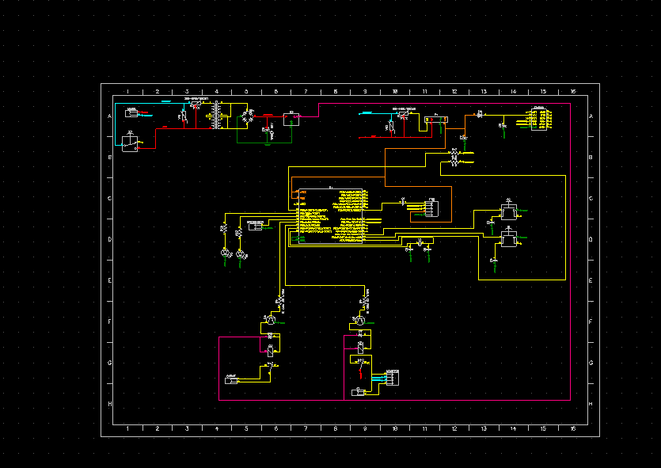

# Smart Data Logger - Prepaid Energy Monitor

A prepaid-style energy monitoring system that combines an ESP microcontroller with Firebase cloud services to provide intelligent energy management with automatic load cutoff functionality.

  

## Overview

This system monitors electrical energy consumption in real-time and automatically disconnects the load when a predefined energy quota is reached, similar to a prepaid electricity meter. The system integrates with Firebase for remote monitoring, control, and data logging, making it ideal for energy management in residential, commercial, or industrial applications.

**Key Highlights:**
- Real-time energy monitoring with PZEM004T sensor
- Automatic load cutoff based on energy quotas
- Firebase integration for remote control and data logging
- Wi-Fi connectivity with NTP time synchronization
- Manual relay override capability
- Comprehensive event logging and history tracking

## Features

### 🌐 **Wi-Fi & Time Synchronization**
- Connects to Wi-Fi networks for internet access
- NTP time synchronization for accurate event logging
- Automatic reconnection on network disruption

### 🔥 **Firebase Integration**
- **Remote Configuration**: Set energy limits (in Wh) from Firebase
- **Manual Control**: Override relay state (ON/OFF) remotely
- **Real-time Data**: Continuous upload of sensor readings
- **Event Logging**: Timestamped system events and activities

### ⚡ **Energy Monitoring**
- Continuous measurement of:
  - Voltage (V)
  - Current (A) 
  - Power (W)
  - Energy consumption (Wh)
  - Frequency (Hz)
  - Power Factor
- Updates every 5 seconds

### 🔌 **Smart Load Control**
- Automatic relay cutoff when energy limit is reached
- Instant power restoration upon credit recharge
- Manual override capability via Firebase
- PZEM energy counter reset on new credit detection

### 📊 **Data Logging & Analytics**
- Real-time data streaming to Firebase
- Comprehensive event logging with timestamps
- Historical consumption tracking
- System status monitoring

## Hardware Requirements

### Components
| Component | Model | Purpose |
|-----------|-------|---------|
| **Microcontroller** | ESP32/ESP8266 | Main controller and Wi-Fi connectivity |
| **Energy Meter** | PZEM-004T v3.0 | AC power measurement |
| **Relay Module** | 5V/12V Relay | Load switching control |
| **Power Supply** | 5V DC | System power |

### Pin Configuration
```cpp
#define RELAY_PIN [Your_Pin_Number]    // Digital pin for relay control
// PZEM connected to Serial2 (RX/TX pins)
```

### Circuit Connections
```
ESP32 ←→ PZEM-004T (via UART/Serial2)
ESP32 ←→ Relay Module (Digital Pin)
PZEM-004T ←→ AC Load (In series)
Relay ←→ AC Load (In series)
```

## Software Dependencies

### Arduino IDE Setup
1. Install Arduino IDE (version 1.8.x or higher)
2. Add ESP32/ESP8266 board package
3. Install required libraries

### Required Libraries
```cpp
#include <WiFi.h>          // Wi-Fi connectivity
#include <HTTPClient.h>    // HTTP requests to Firebase
#include <PZEM004Tv30.h>   // PZEM sensor communication
#include <time.h>          // NTP time synchronization
```

Install via Arduino Library Manager:
- `PZEM004Tv30` by Jakub Mandula

## Installation & Setup

### 1. Hardware Assembly
1. Connect PZEM-004T to ESP32 via Serial2 (pins 16, 17)
2. Connect relay module to designated digital pin
3. Wire PZEM and relay in series with your AC load
4. Ensure proper power supply connections

### 2. Firebase Project Setup
1. Create a new Firebase project at [console.firebase.google.com](https://console.firebase.google.com)
2. Enable Realtime Database
3. Set up the following database structure:

```json
{
  "pzem": {
    "voltage": "220.5 V",
    "current": "1.250 A",
    "power": "275.6 W",
    "energy": "1.456 Wh",
    "frequency": "50.00 Hz",
    "pf": "0.95",
    "relay": "ON",
    "energy_limit": "100 Wh"
  },
  "energy_limit": 100,
  "relay_control": "ON",
  "logs": {
    "timestamp1": {
      "time": "2025-09-20 14:30:25",
      "event": "New recharge: 100 Wh"
    }
  }
}
```

4. Configure database rules (for development):
```json
{
  "rules": {
    ".read": true,
    ".write": true
  }
}
```

### 3. Code Configuration
Update the firmware with your credentials:

```cpp
// WiFi credentials
const char* ssid = "Your_WiFi_SSID";
const char* password = "Your_WiFi_Password";

// Firebase URLs (replace with your project URLs)
const char* dataURL = "https://your-project-id-default-rtdb.firebaseio.com/pzem.json";
const char* logsURL = "https://your-project-id-default-rtdb.firebaseio.com/logs.json";
const char* limitURL = "https://your-project-id-default-rtdb.firebaseio.com/energy_limit.json";
const char* controlURL = "https://your-project-id-default-rtdb.firebaseio.com/relay_control.json";

// Pin configuration
#define RELAY_PIN 4  // Adjust to your chosen pin
```

### 4. Upload Firmware
1. Connect ESP32 to computer via USB
2. Select correct board and port in Arduino IDE
3. Compile and upload the firmware
4. Monitor serial output for connection status

## Usage Instructions

### Setting Energy Limits
Update the `energy_limit` value in Firebase Realtime Database:
```json
{
  "energy_limit": 150
}
```
The system will automatically detect the new limit and reset the energy counter.

### Manual Relay Control
Control the relay remotely by updating `relay_control`:
```json
{
  "relay_control": "OFF"
}
```
Options: `"ON"` or `"OFF"`

### Monitoring Data
Real-time data is available in the `pzem` node:
- **Voltage**: AC voltage measurement
- **Current**: Load current
- **Power**: Instantaneous power consumption
- **Energy**: Cumulative energy consumption
- **Frequency**: AC frequency
- **Power Factor**: Power factor
- **Relay**: Current relay state
- **Energy Limit**: Current energy quota

### Event Logs
System events are logged in the `logs` node with timestamps:
- New recharge detections
- Energy limit exceedances
- Manual relay operations
- System status updates

## Technical Details

### System Operation Cycle
The system operates on a 5-second loop cycle:

1. **Fetch Energy Limit**: Retrieves current energy quota from Firebase
2. **Check Manual Override**: Processes remote relay control commands
3. **Read Sensor Data**: Collects all PZEM measurements
4. **Apply Energy Logic**: Compares consumption against limit
5. **Control Relay**: Switches load based on logic decisions
6. **Upload Data**: Sends real-time data to Firebase
7. **Log Events**: Records significant system events

### Automatic Cutoff Logic
```cpp
if (energyLimit > 0 && !isnan(energy) && energy >= energyLimit) {
    if (relayState) logEvent("Energy exceeded limit. Relay OFF");
    relayState = false;
}
```

### Recharge Detection
The system detects new credits by monitoring changes in the `energy_limit` value:
```cpp
if (newLimit != lastEnergyLimit && newLimit > 0) {
    energyLimit = newLimit;
    pzem.resetEnergy();  // Reset energy counter
    relayState = true;   // Restore power supply
    logEvent("New recharge: " + String(energyLimit) + " Wh");
}
```

### Time Synchronization
NTP servers provide accurate timestamps:
```cpp
configTime(0, 0, "pool.ntp.org", "time.nist.gov");
```

## Troubleshooting

### Common Issues

**1. Wi-Fi Connection Problems**
- Verify SSID and password
- Check network signal strength
- Ensure 2.4GHz network (ESP32 doesn't support 5GHz)

**2. Firebase Communication Errors**
- Verify Firebase URLs are correct
- Check database rules allow read/write access
- Ensure internet connectivity

**3. PZEM Sensor Issues**
- Check UART connections (RX/TX)
- Verify baud rate (9600 for PZEM-004T)
- Ensure proper AC wiring

**4. Relay Not Responding**
- Check relay pin configuration
- Verify relay module power supply
- Test relay logic (some modules are active LOW)

**5. Inaccurate Time Stamps**
- Check NTP server accessibility
- Verify timezone configuration
- Ensure stable internet connection

### Debug Information
Monitor serial output for system status:
```
Connecting to WiFi...
Connected!
LOG: New recharge: 100 Wh
LOG: Data: 45.2Wh used / 100Wh limit
```

## Circuit Explanation



### System Architecture
```
[AC Supply] → [PZEM Meter] → [Relay] → [Load]
                    ↓
[ESP32] ← [Wi-Fi Network] → [Firebase Cloud]
   ↓
[Control Signal] → [Relay Module]
```

**ESP Microcontroller**: Central processing unit handling Wi-Fi communication, Firebase integration, sensor data processing, and relay control logic.

**PZEM Energy Meter**: Measures AC parameters (voltage, current, power, energy, frequency, power factor) and communicates with ESP via UART protocol.

**Relay Module**: Electrically isolated switch controlled by ESP digital output, enabling remote load disconnection.

**Wi-Fi Network**: Provides internet connectivity for Firebase communication, NTP synchronization, and remote monitoring.

**Power Supply**: Provides stable DC power to ESP and relay module while PZEM monitors AC side.

## Contributing

This firmware was developed by **Hammed Quyum** in September 2025 for ThirdEnergy smart IoT micro-station project.

### Development
- Fork the repository
- Create feature branches
- Submit pull requests for improvements

### Reporting Issues
- Use GitHub issues for bug reports
- Include serial monitor output
- Describe hardware configuration

## License

This project is licensed under the MIT License - see the LICENSE file for details.

## Contact

For technical support or questions regarding this project, please contact the development team.

---

**© 2025 ThirdEnergy - Smart IoT Energy Management Solutions**
